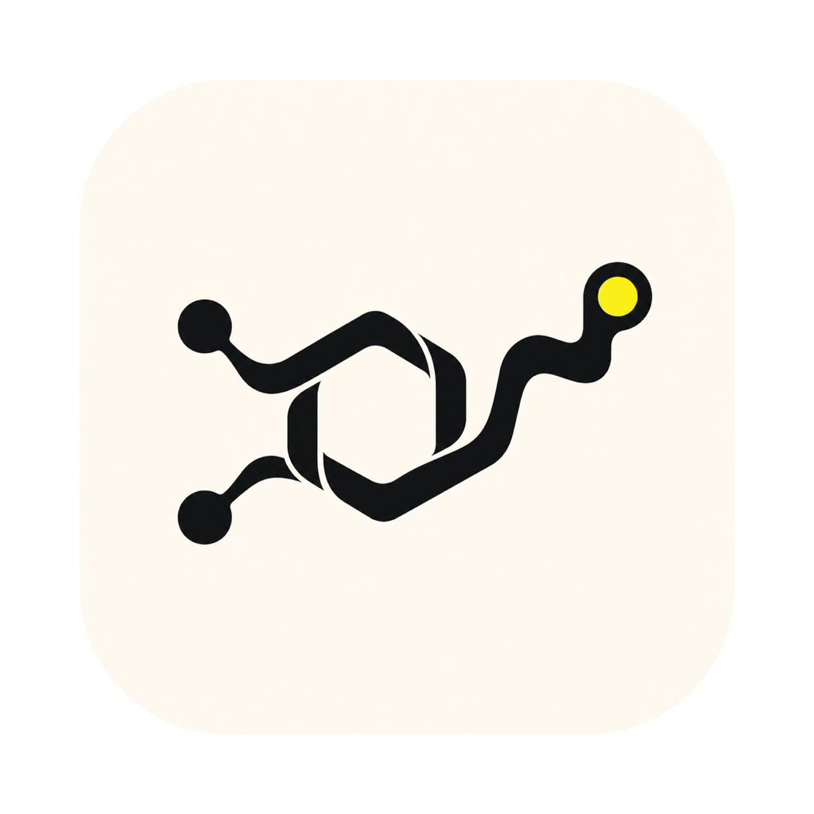

<p align="center">
  
</p>

# Dopamine

A keyboard-first Ratatui music player for a local, offline library, with an optional yt-dlp powered YouTube and YouTube Music import workflow.

## Features

- Local MP3, FLAC, OGG, WAV, and M4A library scanning
- Browsing by track, artist, album, genre, playlist, and smart collection
- Search, favorites, play counts, recently played, and listening statistics
- Play, pause, seek, previous/next, volume, speed, shuffle, repeat, and queue editing
- Gapless decoder preloading, crossfade transitions, a real ten-band EQ, and FFT visualizer
- Metadata editing, synchronized and plain lyrics, online lyrics lookup, and timing offsets
- Output-device selection, sleep timer, themes, M3U export, Last.fm, and macOS media controls
- Persistent SQLite library, playlists, queue, playback settings, and configuration
- SoundSnatch wizard for YouTube and YouTube Music audio downloads
- Responsive 80×24 terminal UI, fuzzy command palette, contextual actions, and mouse support

## SoundSnatch

The Downloads view accepts a YouTube/YouTube Music URL or a song search. It supports:

- Single tracks and playlists
- MP3, FLAC, and WAV conversion
- Destination folder browsing and folder creation
- Live percentage and playlist item progress
- Download archives that skip files already downloaded

SoundSnatch delegates all media work to external tools:

- `yt-dlp`, falling back to `python3 -m yt_dlp`
- `ffmpeg`
- `node`

No YouTube OAuth, embedded login, API client, or media decoder is implemented in Dopamine.

## Build

Build and launch the terminal application:

```bash
cargo run --release
```

The UI requires an 80×24 or larger terminal. True color and mouse input are used when
available; every workflow remains keyboard accessible.

## Controls

- Arrow keys or `j`/`k`: move selection
- Enter: open or play the selected item
- Space: play or pause
- `/`: focus library search
- `Ctrl+P`: open the searchable command palette
- `p` / `n`: previous / next track
- `<` / `>`: seek by 10 seconds
- `f`: toggle favorite
- `a`: open contextual actions
- Delete: remove the selected queue item
- `[` / `]`: adjust synchronized lyrics
- `?`: show complete help
- Escape: close an editor or navigate back

Primary navigation, rows, and player controls are also available through the mouse.

## Configuration

Application configuration and library data:

- `~/.config/dopamine/config.toml`
- `~/.config/dopamine/library.db`

SoundSnatch settings and global single-track archive:

- `~/.soundsnatch.yaml`
- `~/.soundsnatch_archive.txt`

SoundSnatch settings remember the destination directory and output format.

## Verification

```bash
cargo test
cargo check --all-targets
```
